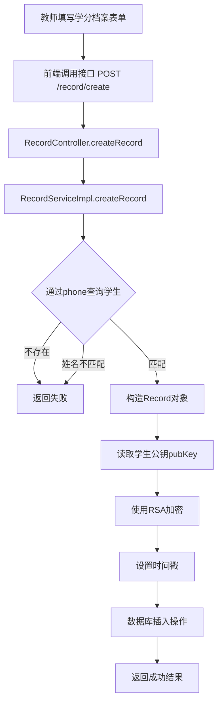
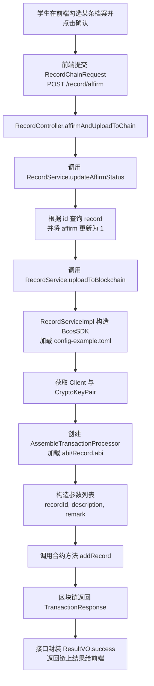
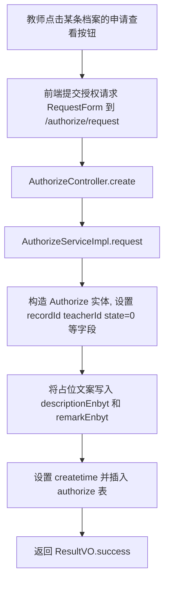
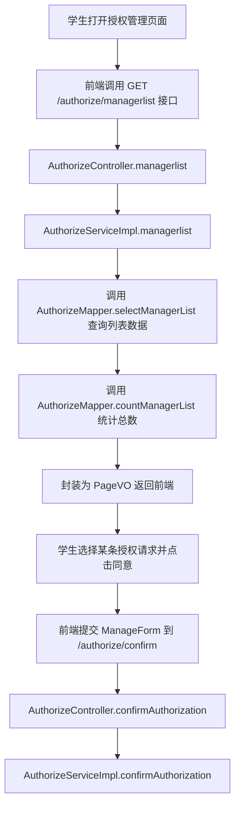
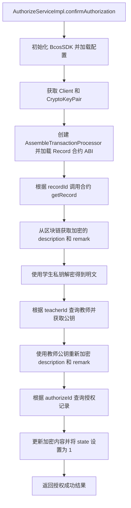
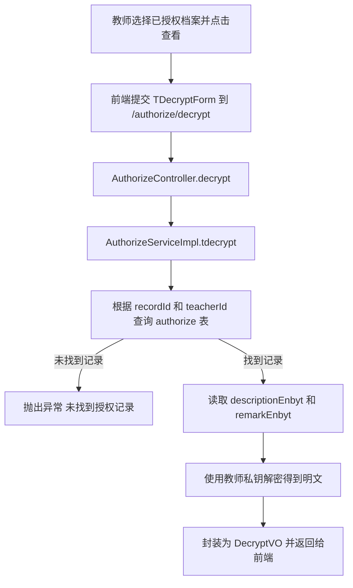

## 一、项目概述

本项目是一个基于 **Spring Boot + MyBatis-Plus + MySQL + FISCO BCOS 区块链** 的学分档案管理系统，主要面向学生与教师两类用户，实现学分档案的创建、查看、授权与链上存证，并通过 **RSA 非对称加密** 保护学分档案在存储与传输过程中的隐私与安全。

系统通过前后端分离的方式提供 REST 接口，后端负责业务逻辑处理、数据库持久化以及与 FISCO BCOS 区块链网络的交互，实现“本地数据库 + 区块链存证”的混合架构。

---

## 二、技术栈说明

### 2.1 后端基础框架

- **Spring Boot 2.7.0**
  - 提供基础 Web 容器与自动配置，入口类为 `com.zyx.CreditApplication`。
  - 使用 `@SpringBootApplication` 启动，`@MapperScan("com.zyx.mapper")` 扫描 MyBatis-Plus Mapper 接口。

- **Spring Web (spring-boot-starter-web)**
  - 提供 REST 风格的 HTTP 接口支持，控制器位于 `com.zyx.controller` 包下。

- **MyBatis-Plus 3.3.2**
  - 用于简化 MySQL 的 ORM 操作：
  - 实体类位于 `com.zyx.entity` 包下（`Student`、`Teacher`、`Record`、`Authorize`）。
  - Mapper 接口位于 `com.zyx.mapper` 包下，并配合 `mapper/xml` 中的 XML 映射文件（或注解 SQL）。
  - `PageConfiguration` 中通过 `PaginationInterceptor` 开启分页能力。

- **MySQL 8.0**
  - 通过 `spring.datasource` 配置连接数据库 `bank`，主要业务表包括：
  - **student**：学生基本信息及公钥。
  - **teacher**：教师基本信息及公钥。
  - **record**：学分档案主表，存储经学生公钥加密后的学分描述与备注。
  - **authorize**：授权记录表，存储经教师公钥加密后的档案数据以及授权状态。

- **Lombok**
  - 通过 `@Data`、`@EqualsAndHashCode` 等注解简化实体类、VO、Form 对象的 Getter/Setter 等样板代码。

### 2.2 区块链与加密相关

- **FISCO BCOS Java SDK 2.9.1**
  - 通过 `org.fisco-bcos.java-sdk` 依赖接入区块链：
  - `AuthorizeServiceImpl`、`RecordServiceImpl` 中使用 `BcosSDK`、`Client`、`CryptoKeyPair`、`AssembleTransactionProcessor` 与链上合约交互。
  - ABI 文件位于 `src/main/resources/abi/Record.abi` 和 `Table.abi`，示例配置文件为 `config-example.toml`。
  - `com.zyx.fisco.Record`、`com.zyx.fisco.Table` 为由 ABI 生成的合约包装类，提供 `addRecord`、`getRecord` 等方法（当前业务逻辑主要通过通用 TransactionProcessor 调用 ABI 文件）。

- **RSA 非对称加密（Bouncy Castle 支持）**
  - 加密工具类：`com.zyx.util.RSAUtil`。
  - 使用 Bouncy Castle 作为 Provider，提供：
    - 公私钥生成与序列化（Base64 / Hex）。
    - **加密**：`RSAUtil.encrypt(byte[] plainText, String publicKeyStr)`，使用公钥加密，结果为十六进制字符串。
    - **解密**：`RSAUtil.decrypt(String encryptTextHex, String privateKeyStr)`，使用私钥解密为明文字符串。
  - 学生与教师实体中分别存储 `publickey` 字段，用于加密学分档案。

- **自定义异常与工具类**
  - `BlockchainException`：用于描述区块链交互异常。
  - `CommonUtil.createDate()`：统一生成 `yyyy-MM-dd` 格式日期字符串。
  - `ResultVOUtil`：统一封装接口返回的成功 / 失败结果。

### 2.3 其他技术

- **跨域配置**：`CrossConfiguration` 通过实现 `WebMvcConfigurer`，对所有路径开启 CORS 支持，允许常用 HTTP 方法与跨域请求。
- **代码生成工具**：`Main` 类中使用 MyBatis-Plus `AutoGenerator` 连接数据库，自动生成 Entity / Mapper / Service / Controller 等代码结构（仅开发阶段使用，不参与运行时业务）。

---

## 三、整体架构设计

### 3.1 分层架构

系统采用典型的分层架构，自下而上主要分为：

- **持久层（DAO / Mapper 层）**
  - 位置：`com.zyx.mapper` 及其 `xml` 文件。
  - 职责：
    - 定义并实现对 `student`、`teacher`、`record`、`authorize` 等表的增删改查。
    - 使用 MyBatis-Plus `BaseMapper` 提供基础 CRUD，部分复杂查询通过注解 SQL 或 XML 编写（如 `AuthorizeMapper.selectManagerList` / `countManagerList`）。

- **领域模型层（Entity & VO & Form）**
  - **实体（Entity）**：`Student`、`Teacher`、`Record`、`Authorize` 对应数据库表结构。
  - **传输对象（VO）**：`ResultVO`、`PageVO`、`RecordVO`、`ViewRecordVO`、`ManagerVO`、`DecryptVO`，用于接口返回的视图模型与分页包装。
  - **表单对象（Form）**：`LoginForm`、`CreateForm`、`RequestForm`、`ManageForm`、`DecryptForm`、`TDecryptForm`、`RecordChainRequest`，用于接收前端请求参数。

- **服务层（Service）**
  - 位置：`com.zyx.service` 与 `com.zyx.service.impl`。
  - 职责：
    - 实现核心业务逻辑，包括：登录、档案创建、分页查询、授权管理、链上交互、RSA 加解密等。
    - 对 DAO 层进行封装，对上暴露更高层次的业务接口。

- **接口层（Controller）**
  - 位置：`com.zyx.controller`。
  - 职责：
    - 暴露 REST 接口（`/record`、`/authorize`、`/student`、`/teacher`），接收前端请求、参数校验和调用 Service。
    - 统一使用 `ResultVO` 作为返回格式，便于前端根据 `code` 判断成功 / 失败并处理 `data`。

- **区块链接入层（FISCO BCOS）**
  - 通过 Java SDK 与合约交互，实现：
    - 学分档案确认并上链（`addRecord`）。
    - 授权时从链上读取并解密档案（`getRecord`）。

### 3.2 模块划分

- **学生模块**
  - 控制器：`StudentController`（`/student`）。
  - 服务：`StudentService` / `StudentServiceImpl`。
  - 功能：学生登录、查看个人学分档案列表、查看授权管理列表、使用私钥解密档案内容。

- **教师模块**
  - 控制器：`TeacherController`（`/teacher`）。
  - 服务：`TeacherService` / `TeacherServiceImpl`。
  - 功能：教师登录、为学生创建学分档案、查看可访问档案列表、申请查看某条档案、使用私钥解密已授权档案内容。

- **学分档案模块（Record 模块）**
  - 控制器：`RecordController`（`/record`）。
  - 服务：`RecordService` / `RecordServiceImpl`。
  - 功能：
    - 新建学分档案并以学生公钥加密存储。
    - 按学生 / 教师维度分页查询档案视图。
    - 使用私钥对学分档案执行解密（学生使用自己的私钥）。
    - 学分档案确认并上链存证。

- **授权管理模块（Authorize 模块）**
  - 控制器：`AuthorizeController`（`/authorize`）。
  - 服务：`AuthorizeService` / `AuthorizeServiceImpl`。
  - 功能：
    - 教师对某条学分档案发起访问授权请求。
    - 学生查看授权请求列表（分页）。
    - 学生确认授权，并触发链上查询 + RSA 重加密逻辑。
    - 教师使用私钥解密已授权档案。

- **安全与加密模块**
  - 工具类：`RSAUtil`、`BlockchainException`、`CommonUtil`、`ResultVOUtil`。
  - 功能：统一封装 RSA 加解密、时间日期生成、返回对象包装和区块链异常。

---

## 四、主要业务功能与接口

### 4.1 登录与身份管理

- **学生登录接口**
  - **URL**：`GET /student/login`
  - **参数**：`LoginForm`（`phone`，`password`）。
  - **流程**：
    - 根据手机号查询 `student` 表，若不存在则返回 `code = -1`。
    - 若存在则对比密码，不匹配返回 `code = -2`。
    - 匹配成功返回 `code = 0`，并在 `data` 中携带学生信息（包含公钥）。

- **教师登录接口**
  - **URL**：`GET /teacher/login`
  - **参数**：`LoginForm`（`phone`，`password`）。
  - **流程**：与学生登录类似，根据手机号匹配教师信息与密码，返回对应状态码。

### 4.2 学分档案管理（Record 模块）

- **新建档案**
  - **URL**：`POST /record/create`
  - **请求体**：`CreateForm`
    - `teacherid`：教师 ID
    - `name`：学生姓名
    - `phone`：学生手机号（作为账号）
    - `school`：学校
    - `stuid`：学号
    - `description`：学分档案内容（明文）
    - `remark`：备注（明文）
  - **核心逻辑（RecordServiceImpl.create）**：
    - 通过手机号查询 `student`，若不存在返回失败。
    - 对比姓名是否一致，不一致返回失败。
    - 读取学生公钥 `publickey`，使用 `RSAUtil.encrypt` 对 `description` 与 `remark` 进行加密，结果保存到 `Record.descriptionEnbys`、`Record.remarkEnbys`。
    - 设置 `student_id`、`teacher_id`、`affirm = 0`、`createtime` 等字段，插入 `record` 表。

- **学生查看个人档案列表**
  - **URL**：`GET /record/studentlist/{id}/{page}/{size}`
  - **说明**：根据 `student_id` 分页查询 `record` 表，封装为 `RecordVO` 列表并返回 `PageVO`。
  - **返回字段（RecordVO）**：档案 ID、创建时间、学生姓名、电话、学校、学号、课程、教师学校、档案加密内容 `description` / `remark`、确认状态 `affirm`。

- **教师查看档案列表（视图）**
  - **URL**：`GET /record/teacherlist/{id}/{page}/{size}`
  - **说明**：分页查询 `record` 表，并通过批量查询方式联合 `student`、`teacher` 信息封装为 `ViewRecordVO`。
  - **特殊字段**：
    - `state`：教师对该档案的授权状态（从 `authorize` 表中查询，0/1/-1）。

- **档案解密（学生侧）**
  - **URL**：`POST /record/decrypt`
  - **请求体**：`DecryptForm`（`privatekey`，`description`，`remark`），其中 `description` / `remark` 为从前端传来的加密字符串。
  - **逻辑**：
    - 使用学生私钥调用 `RSAUtil.decrypt` 解密 `description` 与 `remark`，返回 `DecryptVO` 明文内容。

- **档案确认并上链**
  - **URL**：`POST /record/affirm`
  - **请求体**：`RecordChainRequest`（`id`，`description`，`remark`）。
  - **逻辑**：
    - 调用 `RecordService.updateAffirmStatus` 将 `record.affirm` 更新为 `1`（已确认）。
    - 调用 `RecordService.uploadToBlockchain`：
      - 使用 `BcosSDK.build("src/main/resources/config-example.toml")` 初始化 SDK（在构造函数中完成）。
      - 获取客户端 `Client client = bcosSDK.getClient(1)`。
      - 创建密钥对 `CryptoKeyPair keyPair = client.getCryptoSuite().createKeyPair()`。
      - 使用 `TransactionProcessorFactory.createAssembleTransactionProcessor` 指定 `abi` 目录与合约名 `Record`。
      - 构造参数 `[recordId, description, remark]` 调用合约方法 `addRecord`。
    - 接口返回区块链交易回执中的返回对象。

### 4.3 授权管理（Authorize 模块）

- **教师发起授权请求**
  - **URL**：`POST /authorize/request`
  - **请求体**：`RequestForm`（`teacherid`，`recordid`，`authstatus`）。
  - **核心逻辑（AuthorizeServiceImpl.request）**：
    - 创建 `Authorize` 记录：
      - `record_id` = 请求的档案 ID。
      - `teacher_id` = 请求的教师 ID。
      - `description_enbyt`、`remark_enbyt` 初始值为固定文案：“无数据，请申请授权”。
      - `state` = 0（待授权）。
      - `createtime` = 当前日期。
    - 插入到 `authorize` 表，作为授权申请记录。

- **学生查看授权管理列表**
  - **URL**：`GET /authorize/managerlist/{id}/{page}/{size}`
  - **说明**：以学生 ID 为维度，分页查看所有针对该学生发起的授权请求。
  - **实现**：
    - `AuthorizeMapper.selectManagerList`：
      - 通过 SQL 联合查询 `authorize`、`record`、`teacher` 三张表，返回 `ManagerVO` 列表，包含授权记录 ID、档案 ID、学生 ID、教师 ID、课程、教师学校、授权状态等。
    - `AuthorizeMapper.countManagerList`：获取总记录数，封装为 `PageVO`。

- **学生确认授权并为教师重加密档案**
  - **URL**：`POST /authorize/confirm`
  - **请求体**：`ManageForm`（`authorizeid`，`privatekey`，`recordid`，`teacherid`）。
  - **核心逻辑（AuthorizeServiceImpl.confirmAuthorization）**：
    1. 从配置文件 `config-example.toml` 中构建 `BcosSDK`，获取 `Client`（群组 ID = 1）。
    2. 创建密钥对 `CryptoKeyPair`，构造 `AssembleTransactionProcessor` 并加载 `abi/Record.abi`。
    3. 调用合约 `Record.getRecord(recordid)`，获取链上存证的档案内容（description, remark）。
    4. 使用学生私钥 `privatekey` 通过 `RSAUtil.decrypt` 对链上返回的加密数据进行解密，获得明文 `description_decrypt`、`remark_decrypt`。
    5. 根据 `teacherid` 查询教师，获取教师公钥 `tpublickey`。
    6. 使用教师公钥将明文再次加密，得到 `description_enbyt`、`remark_enbyt`。
    7. 根据 `authorizeid` 查询授权记录并更新：
       - 将加密后的内容写入 `authorize.descriptionEnbyt`、`authorize.remarkEnbyt`。
       - 将 `state` 更新为 1（已授权）。
    8. 返回 "授权成功"。

- **教师解密已授权档案**
  - **URL**：`POST /authorize/decrypt`
  - **请求体**：`TDecryptForm`（`privatekey`，`teacherid`，`recordid`）。
  - **核心逻辑（AuthorizeServiceImpl.tdecrypt）**：
    - 根据 `recordid` + `teacherid` 在 `authorize` 表中查询对应授权记录。
    - 获得加密的 `description_enbyt` 与 `remark_enbyt`。
    - 使用教师私钥对两字段进行解密，封装为 `DecryptVO` 并返回给前端。

---

## 五、复杂业务流程分析与流程图

### 5.1 学分档案创建流程（教师端）

**场景**：教师为某一学生新建学分档案，内容在数据库中采用学生公钥加密存储。

### 5.2 学分档案确认并上链存证流程（学生端）

**场景**：学生对某条学分档案进行确认，并将其内容存证到区块链。

### 5.3 学分档案授权与教师查看流程

该流程涉及学生、教师、数据库以及区块链的多方交互，是系统中最复杂的业务流程之一，可拆分为三个阶段：

#### 5.3.1 教师发起授权请求

#### 5.3.2 学生查看授权列表并确认授权

#### 5.3.3 基于区块链与 RSA 的授权确认流程

#### 5.3.4 教师解密已授权档案流程

---

## 六、数据模型与字段说明（简要）

### 6.1 学生表（Student）

- **id**：主键，自增。
- **name**：姓名。
- **phone**：手机号 / 登录账号。
- **password**：登录密码（明文或简单加密，视实际数据库而定）。
- **school**：学校。
- **stuId**：学号。
- **publickey**：RSA 公钥，用于加密学分档案内容。

### 6.2 教师表（Teacher）

- **id**：主键，自增。
- **name**：姓名。
- **phone**：手机号 / 登录账号。
- **password**：登录密码。
- **school**：院校。
- **course**：授课课程。
- **publickey**：RSA 公钥，用于加密授权后的档案内容。

### 6.3 学分档案表（Record）

- **id**：主键，自增。
- **teacherId**：创建该档案的教师 ID。
- **studentId**：档案所属学生 ID。
- **createtime**：档案创建时间。
- **descriptionEnbys**：使用学生公钥加密后的学分档案描述。
- **remarkEnbys**：使用学生公钥加密后的备注。
- **affirm**：是否确认标记（0：未确认；1：已确认）。

### 6.4 授权表（Authorize）

- **id**：主键，自增。
- **teacherId**：申请查看档案的教师 ID。
- **recordId**：目标档案 ID。
- **descriptionEnbyt**：使用教师公钥加密后的档案描述。
- **remarkEnbyt**：使用教师公钥加密后的档案备注。
- **state**：授权状态（0：待授权；1：已授权）。
- **createtime**：授权记录创建时间。

---

## 七、小结

- 本项目通过 **Spring Boot + MyBatis-Plus + MySQL** 实现常规的用户与档案管理，通过 **FISCO BCOS 区块链** 实现学分档案的链上存证与可追溯性，并使用 **RSA 非对称加密** 确保档案在存储与传输过程中的机密性与最小暴露原则。
- 通过“学生公钥加密存储 + 区块链存证 + 授权后用教师公钥重加密 + 私钥解密查看”的完整链路，实现了对学分档案的精细化访问控制和多角色协同，适合作为基于联盟链的教育场景学分管理系统的参考实现。
